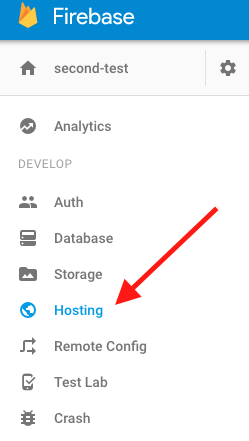
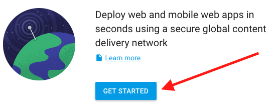

# React Firebase Chat App

For this workshop you'll start with a fully functioning React web application. During the workshop you'll add about 50 lines of code that will connect your app to Firebase, a persistent server-side database run by Google.

## Getting started

**Create an account on [https://firebase.google.com/](https://firebase.google.com/) (follow the "Get Started For Free" button)!**

1. Download this repo.
2. In your terminal `cd`* into this folder.
3. Then run `npm install`.
4. Finally run `npm start` to run the project.
5. In your browser go to `http://localhost:3000/`, you should see 4 messages, and you should be able to "send" messages.

*Windows users will use `dir`

## Adding Firebase

On the web there are at least 3-4 ways of adding Firebase to a react web project. I choose the method that seems the most natural for Redux, uses ES6 classes and requires the least amount of work.

### Installing Firebase

```sh
npm install firebase --save
```

Note that we are not using Firebase's react library as it relies on outdated concepts.


### Adding Firebase config info

On [https://firebase.google.com/](https://firebase.google.com/) click the "CREATE NEW PROJECT" button and call your project `react-test` and select Country/region Canada, then click "CREATE PROJECT".

In the overview tab of your new project click the round pink button that has the text "Add Firebase to your web app" underneath it - see image below.


*If you do not see the above screen, make sure you click on the project you just created.*

After clicking on the above, copy all that configuration information and paste it into a new file `src/constants/firebase.js` (you'll need to create the `constants` folder). Then update the code you just copy-and-pasted to look like:

```javascript
const firebaseConfig = {
  apiKey: 'YOUR_API_KEY',
  authDomain: 'YOUR_AUTH_DOMAIN',
  databaseURL: 'YOUR_DATABASE_URL',
  storageBucket: 'YOUR_STORAGE_BUCKET'
};

export default firebaseConfig;
```

**IMPORTANT** do not just copy-and-paste the above code, you need to have your own values for each key.

**IMPORTANT 2** if you decide to commit this code to github please add the following to your `.gitignore` file: `src/constants/firebase.js`. That prevents your API key, and other potentially secret info, from making it into your code base.

### Changing Firebase authorization rules

Normally you'd want to restrict parts of your app to authorized/signed-in users. For the simplicity of this workshop we're going to let anyone read/write to our Firebase database.

In your new project on [https://firebase.google.com/](https://firebase.google.com/) click on the database option in the left menu:


Then click on the "RULES" tab:


Finally, update your rules to the following (then save the updates):


The above will allow anyone access to read/write from your database (this would not be desirable for a production application).

Yay, we can now write some application code!

## Firebase application code

In `src/App.js` add the following code - this will initialize Firebase and connect your app the server.

```javascript
import firebaseConfig from './constants/firebase.js';
import firebase from 'firebase';
firebase.initializeApp(firebaseConfig);
```

There should be no errors in the console at this point. If there are errors check that your `./constants/firebase.js` file has the correct values.

### Saving and loading messages from Firebase

Now update `src/actions/messageActions.js` to save messages to Firebase and  to "listen"/fetch messages from Firebase.

```javascript
import firebase from 'firebase';

function sendMessage(userName, text){
  var db = firebase.database().ref().child('messages');
  var timeStamp = Date.now();
  return dispatch => {
    db.push({userName, text, timeStamp}, (error) => {
      console.log(error);
    });
  }
}

function receiveMessages(userName){
  var ref = firebase.database().ref('messages/');

  return dispatch => {
    ref.on('value', (snapshot) => {
      dispatch({ type: 'RECEIVE_MESSAGES',  messages: snapshot.val(), userName});
    });
  }
}

export { sendMessage, receiveMessages };
```

To understand `var db = firebase.database().ref().child('messages');` it's important to understand how Firebase stores data. Firebase stores data in a tree, with the root node being `firebase.database().ref()`. By adding `.child('messages')` we're telling Firebase that we'll be storing our messages in a child node of our database, that we'll name `'messages'`.

`ref.on`, in `receiveMessages()` adds an event handler that will listen for updates to the `'messages'` node. Anytime new data is added to that node, Firebase will push it to any clients (e.g. browsers) that are listening to that change.

### What should call receiveMessages()?

We only want to start listening for messages once the user has entered their name. We'll call `receiveMessages` from the `userActions.js`:

```javascript
import { receiveMessages } from './messageActions.js';

function signIn(userName){
  return dispatch => {
    dispatch({
      type: 'USER_SIGNIN',
      userName: userName
    });

    receiveMessages(userName)(dispatch);
  };
}

export { signIn };
```

Once the user enters their name we'll call receiveMessages to start listening for messsages from Firebase.

### Updating messageReducer.js

Now that we're listening for incoming messages we must be able to process them in our message reducer. Open `src/reducers/messageReducer.js` and add an extra `case`:

```javascript
  case 'RECEIVE_MESSAGES':
    return messagesToArray(action.messages, action.userName);
```

Then above the `messageReducer()` create the `messagesToArray` function. Try to do this on your own. Here are some tips:

1. `action.messages` will either be null (no messages), or an object where keys are the `key` (e.g. id) of the message, and the value is the message.
2. Get all the keys using `Object.keys(yourObject)`.
3. Each message in the returned array should have the following keys: `key`, `userName`, `text`, `timeStamp`, and `isMe`.
4. `isMe` is true if and only if userName is equal to the passed in userName (e.g. `action.userName`).

#### Cheat

```javascript
function messagesToArray(messageObj, userName){
  if(messageObj == null){
    return [];
  }
  var keys = Object.keys(messageObj);
  return keys.map((key) => {
    var obj = messageObj[key];
    return Object.assign({key}, obj, {isMe: obj.userName == userName});
  });
}
```

#### Clean-up

Now that you can create real data, delete the fake data in `messageReducer.js` (e.g. `const MESSAGES = ...`) and update the function signature to:

```javascript
export default function messageReducer(state=[], action){
```

Your app should now be writing data to your Firebase server and reading from it!!!!! **When you first complete the above step you will have zero messages on Firebase, create a few messages to test out your app**.


## Deploying your application to Firebase

In your new project on [https://firebase.google.com/](https://firebase.google.com/) click on the Hosting option in the left menu:



Then click on the `GET STARTED` button (**IMPORTANT** read tips below):



**IMPORTANT TIPS**

* `npm install -g firebase-tools`
* When running `firebase init` 
  * `What Firebase CLI features do you want to setup for this folder? ` select the `Hosting` option
  * `What Firebase project do you want to associate as default?` select the project you created on Firebase.
  * `What file should be used for Database Rules?` hit enter for default option.
  * `What do you want to use as your public directory?` enter: `dist`
  * `Configure as a single-page app (rewrite all urls to /index.html)?` enter: `y`

### To Deploy your applicaiton

#### "Long" instructions

Build the application (webpack will concatenate all your JavaScript and transpile ES6 to ES5), then place conents into the `dist` folder.
```sh
npm run build:prod
```

OR for Windows:
```sh
npm run build:prod:win
```

Copy `index.html` and `style.css`:

```sh
npm run copy:prod
```

Then deploy
```sh
firebase deploy
```

To understand those commands open up `package.json` and examine the `script` portion.

#### Short instructions

Instead of running 3 commands you can just run (which does all of the above):

```sh
npm run deploy
```

OR for Windows:
```sh
npm run deploy:win
```

YAY!


