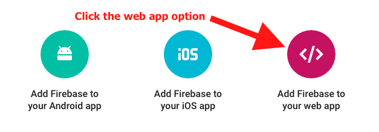
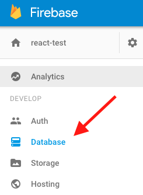
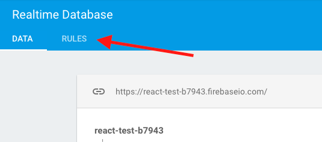
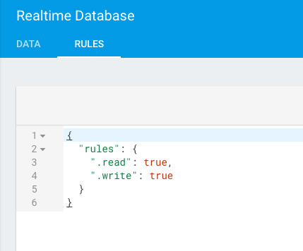

# React Firebase Chat App

For this workshop you'll start with a fully functioning React web application. During the workshop you'll add about 50 lines of code that will connect your app to Firebase, a persistent server-side database run by Google.

## Getting started

**Create an account on [https://firebase.google.com/](https://firebase.google.com/) (follow the "Get Started For Free" button)!**

1. Download this repo.
2. In your terminal `cd`* into this folder.
3. Then run `npm install`.
4. Finally run `npm start` to run the project.
5. In your browser go to `http://localhost:3000/`, you should see 4 messages, and you should be able to "send" messages.

* Windows users will `dir`

## Adding Firebase

On the web there are at least 3-4 ways of adding Firebase to a react web project. I choose the method that seems the most natural for Redux, uses ES6 classes and requires the least amount of work.

### Installing Firebase

```
npm install firebase --save
```

Note that we are not using Firebase's react library as it relies on outdated concepts.


### Adding Firebase config info

On [https://firebase.google.com/](https://firebase.google.com/) click the "CREATE NEW PROJECT" button and call your project `react-test` and select Country/region Canada, then click "CREATE PROJECT".

In the overview tab of your new project click the round pink button that has the text "Add Firebase to your web app" underneath it - see image below.



*If you do not see the above screen, make sure you click on the project you just created.*

After clicking on the above copy all that configuration information and paste it into a new file `src/constants/firebase.js` (you'll need to create the `constants` folder. Then update the code you just copy-and-pasted to look like:

```javascript
const firebaseConfig = {
  apiKey: 'YOUR_API_KEY',
  authDomain: 'YOUR_AUTH_DOMAIN',
  databaseURL: 'YOUR_DATABASE_URL',
  storageBucket: 'YOUR_STORAGE_BUCKET'
};

export default firebaseConfig;
```

**IMPORTANT** do not just copy-and-paste the above code, you need to have your own values for each key.

**IMPORTANT 2** if you decide to commit this code to github please add the following to your `.gitignore` file: `src/constants/firebase.js`. That prevents your API key, and other potentially secrete info, from making it into your code base.

### Changing Firebase authorization rules

Normally you'd want to restrict parts of your app to authorized/signed-in users. For the simplicity of this workshop we're going to let anyone read/write to our Firebase database.

In your new project on [https://firebase.google.com/](https://firebase.google.com/) click on the database option in the left menu:



Then click on the "RULES" tab:



Finally, update your rules to the following (then save the updates):



The above will allow anyone access to read/write from your database (this would not be desirable for a production application).

Yay, we can now write some application code!
